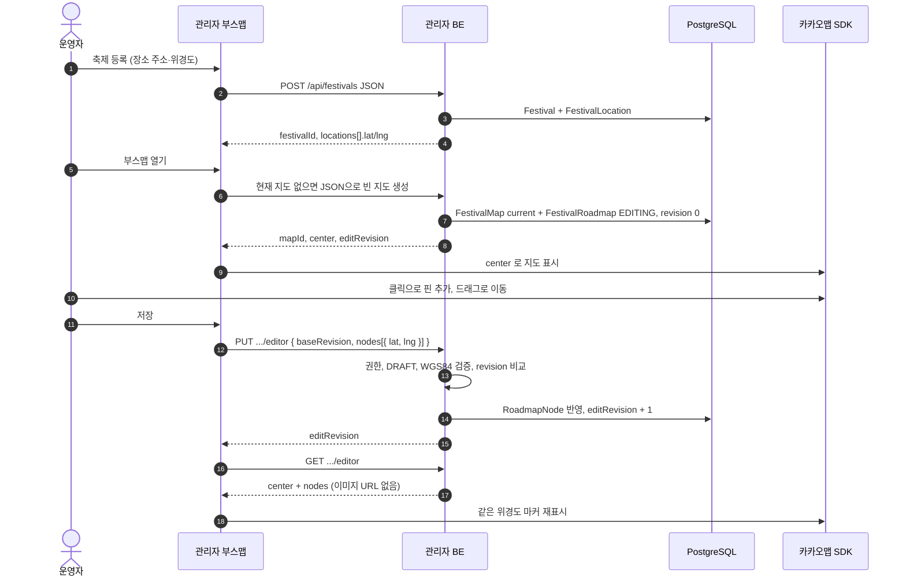
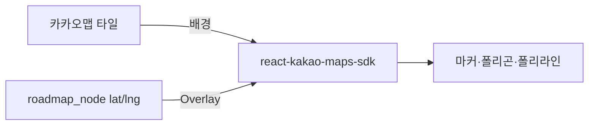
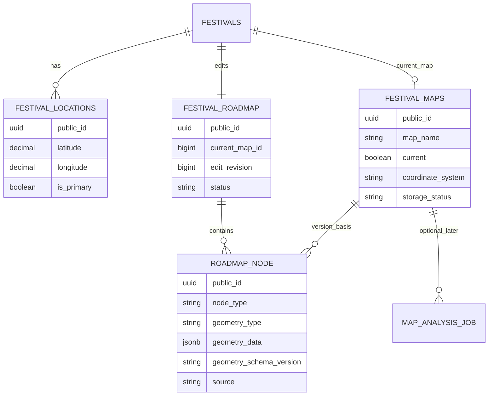
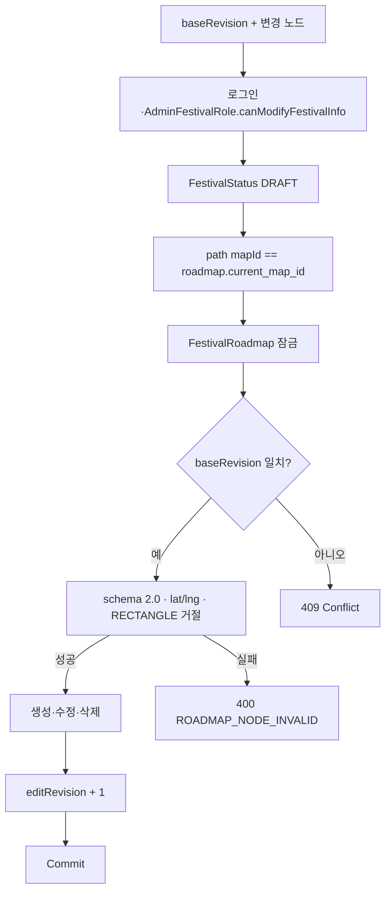
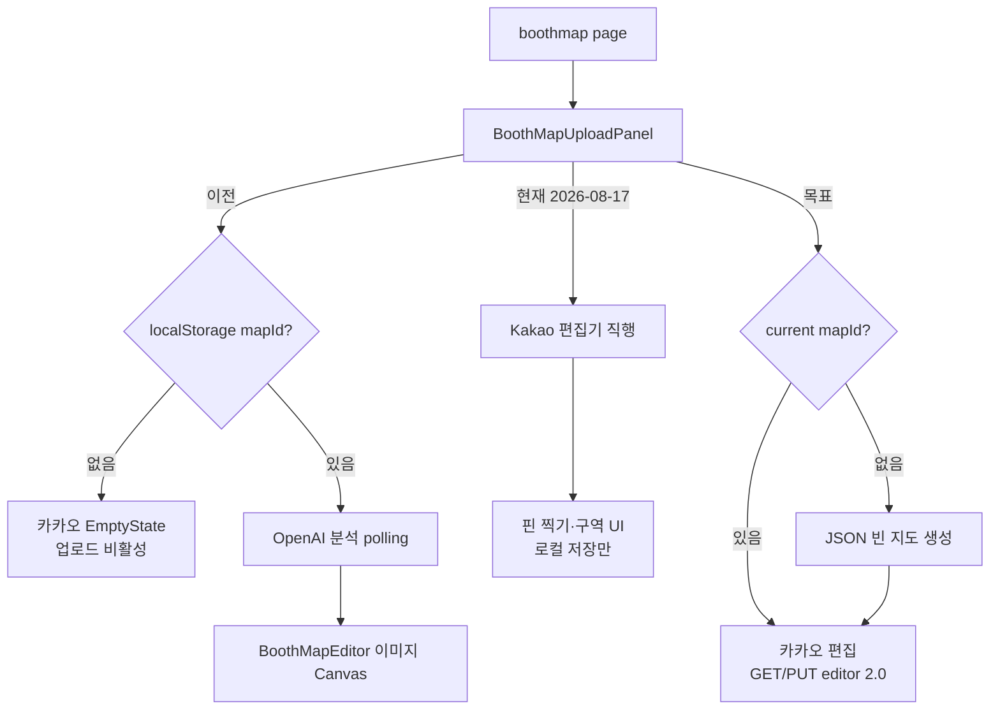
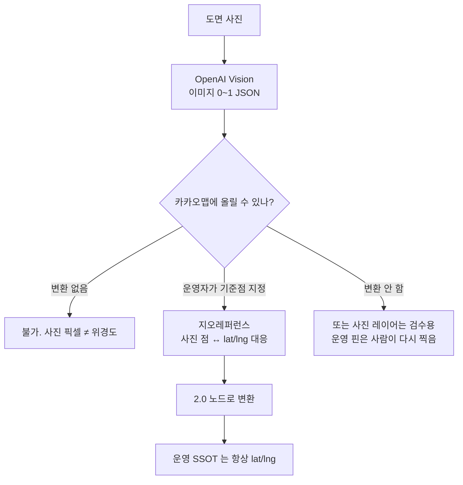

ㅁ문서 형식: 계획서

# 운영자 배치도 등록 파이프라인

기준일: 2026-08-17

관련 문서: `계획서_축제_배치도_S3_파일저장.md` (2026-08-17, 카카오맵 좌표 등록으로 전환)

이 문서는 예전 제목처럼 **도면 사진 → OpenAI → 사진 위 노드**를 운영 1차로 두지 않는다.
운영자가 카카오맵에 좌표를 찍어 저장하는 흐름을 다시 그리고, OpenAI 도면 분석은 후속으로 분리한다.

## 1. 한 줄 결론

운영 배치도의 SSOT는 **WGS84 위경도 노드**다. OpenAI가 새 지도를 그리지 않고, 1차에서는 도면 사진을 분석하지도 않는다.

```text
축제 장소 위경도
  → 카카오맵에서 핀·구역·경로를 찍음
  → roadmap_node.geometry_data 에 lat/lng 저장
  → 같은 좌표로 대시보드(이후 방문자 지도) 표시
```

## 2. 방향 전환

|             | 이전 이 문서 (2026-08-04) | 지금                 |
| ----------- | ------------------------- | -------------------- |
| 운영자 입력 | 도면 사진 업로드          | 카카오맵 클릭        |
| 배경        | S3 display 이미지         | 카카오맵 타일        |
| 좌표        | 이미지 0~1 (`x`,`y`)      | WGS84 (`lat`,`lng`)  |
| OpenAI      | 업로드 직후 필수          | 1차 제외, 후속 선택  |
| 화면        | 사진 위 Canvas/Konva      | 카카오맵 마커·폴리곤 |

사진 좌표와 카카오맵 좌표는 같은 숫자가 아니다. 0~1 노드를 카카오맵에 그대로 그리면 위치가 틀린다.

## 3. 현재 코드 사실 (백엔드 재검토, 2026-08-17)

구현·계획 작성 시 아래를 전제로 쓰지 않는다.

| 계획에 적기 쉬운 말                          | 실제 코드                                                                    |
| -------------------------------------------- | ---------------------------------------------------------------------------- |
| `POST /api/festivals/{festivalId}/maps` JSON | **없음**                                                                     |
| `POST /api/festivals` JSON                   | **축제만** 생성. map·roadmap·job **없음**                                    |
| `POST /api/festivals` multipart              | 축제 + `FestivalMap.uploaded()` + roadmap + 분석 job                         |
| `editRevision` on `FestivalMap`              | **`FestivalRoadmap.editRevision`**                                           |
| 빈 지도 `EMPTY` status                       | **`FestivalMapStorageStatus`만** (UPLOADED 등). EMPTY enum 없음              |
| roadmap 초기 `EDITING`                       | **`ANALYZING`** (`FestivalRoadmap.create`)                                   |
| GET editor 노드만                            | **Presigned URL + imageWidth/Height + analysis job 필수**. job 없으면 404    |
| PUT editor 빈 nodes                          | **`@Size(min=1)`** + 서비스 검증                                             |
| geometry `lat`/`lng`                         | **`x`/`y` 0~1만** (`MapGeometryValidator`). schema `"1.0"`                   |
| PUT during ANALYZING                         | **`FESTIVAL_MAP_INVALID_STATUS`**                                            |
| 분석 FAILED 후 편집                          | roadmap **ANALYZING 유지** → PUT **여전히 불가**                             |
| GET editor 권한                              | 역할 존재만 확인. **canModify·DRAFT 검사 없음**                              |
| PUT editor 권한                              | **DRAFT + canModifyFestivalInfo**                                            |
| revision 충돌 코드                           | **`ROADMAP_REVISION_CONFLICT`** (409). `FESTIVAL_MAP_REVISION_CONFLICT` 없음 |
| `FESTIVAL_MAP_LOCATION_REQUIRED`             | **ErrorCode에 없음**                                                         |
| `FestivalBooth` 좌표                         | Admin BE에 **없음**                                                          |
| `coordinateSystem` / `center` in editor GET  | **응답 DTO에 없음**                                                          |

**이미 있는 것 (재확인):**

- `PUT/GET .../editor`, `baseRevision` 낙관적 잠금
- `RoadmapNode` CRUD (create/update/delete 일괄)
- `NodeType` / `GeometryType` enum
- `FestivalLocation.latitude/longitude` (축제 장소, map geometry와 **별개**)
- OpenAI 분석 파이프라인 (multipart map 전용)

## 4. 목표 파이프라인 (1차)

```mermaid
flowchart TD
    OP[운영자]
    FEST[축제 JSON 생성<br/>POST /api/festivals]
    LOC[FestivalLocation<br/>primary 위경도]
    MAP[빈 지도 버전 생성<br/>이미지 없이 FestivalMap + Roadmap]
    KAKAO[카카오맵<br/>축제 장소 중심]
    CLICK[핀 / 폴리곤 / 폴리라인 찍기]
    SAVE[PUT .../maps/{mapId}/editor<br/>lat lng]
    DB[(roadmap_node<br/>geometry_schema_version 2.0)]
    DASH[대시보드 카카오맵]

    OP --> FEST --> LOC
    LOC --> MAP --> KAKAO --> CLICK --> SAVE --> DB --> DASH
    DASH --> OP
```

OpenAI, S3, Presigned URL, 분석 polling 은 이 그림에 넣지 않는다.

## 5. 운영자가 보는 요청·응답



빈 지도 생성 API는 **새로 만든다.** 지금 있는 multipart 축제 생성·`replacement`·`read-url` 을 이 경로에 재사용하지 않는다. 경로 후보는 다음 중 하나로 고정한다.

```text
POST /api/festivals/{festivalId}/maps
Content-Type: application/json
{ "mapName": "본행사 배치" }
```

이미 current 지도가 있으면 새로 만들지 않고 그 `mapId` 로 편집한다. 409 로 막거나 조회 후 재사용한다. 1차 기본은 재사용이다.

## 6. 저장하는 좌표

브라우저 픽셀, 카카오 투영 좌표, 이미지 0~1 을 DB 에 넣지 않는다. 카카오 클릭의 **위경도**만 저장한다.

```json
{
  "geometryType": "POINT",
  "geometry": {
    "lat": 36.1398,
    "lng": 128.017
  }
}
```

| geometryType | 1차                          | geometry                                                            |
| ------------ | ---------------------------- | ------------------------------------------------------------------- |
| `POINT`      | 부스·무대·화장실·출입구 기본 | `{ lat, lng }`                                                      |
| `POLYGON`    | 구역, 점 3개 이상            | `{ points: [{ lat, lng }] }`                                        |
| `POLYLINE`   | 통로, 점 2개 이상            | `{ points: [{ lat, lng }] }`                                        |
| `RECTANGLE`  | 비활성                       | 이미지용 `x,y,width,height` 와 섞지 않음. 사각형 구역은 POLYGON 4점 |

검증:

```text
lat:  -90 ~ 90, 유한
lng: -180 ~ 180, 유한
points: 연속 중복 금지, 도형당 최대 200점
요청 노드: 1~1000 (기존 editor 한도)
schema: geometry_schema_version = "2.0"
```

`"1.0"` (0~1) 과 `"2.0"` (WGS84) 을 한 지도에서 섞지 않는다. 카카오 편집 대상은 2.0 만 연다.

`PUT .../editor` 의 최소 1개 제약은 **첫 저장에 핀이 있을 때**는 유지해도 된다. 핀을 모두 지운 저장을 허용하려면 `min = 0` 으로 바꾸고, 노드 0개면 상태를 빈 지도로 되돌릴지 정책을 정한다. 기본값은 1차에서 최소 1개 유지.

## 7. 화면 합성



Layer 0 은 더 이상 display 사진이 아니다. Konva 이미지 에디터(`BoothMapEditor`)는 1차 운영 화면이 아니다. `BoothMapEditorEmptyState` 에서 파일 없음으로 도구를 잠그지 않는다.

초기 중심:

1. primary `FestivalLocation` 위경도
2. 없으면 저장된 노드 평균
3. 둘 다 없으면 지도 생성·편집을 막고 장소 좌표부터 받는다

`FESTIVAL_MAP_CENTER`(김천 하드코딩) 는 `?preview=ready` 전용이다.

## 8. 도메인 역할



원칙:

```text
카카오 타일은 저장하지 않는다.
DB 에는 위경도 JSON 만 넣는다.

FestivalMap 은 파일 자산이 아니라 지도 버전 컨테이너다.
이미지 Key 는 1차에서 필수에서 뺀다 (nullable 권고).

editRevision 은 FestivalRoadmap 에 둔다.
노드는 자신이 속한 map_id 에 귀속한다.
```

`FestivalMap` 상태와 `FestivalRoadmap` 상태를 한 enum 에 섞지 않는다.

- 파일: `UPLOADED` / `REPLACED` … (이미지 후속)
- 편집 문서: `EDITING` (1차). `ANALYZING` 은 사진 Job 이 있을 때만

이미지 없이 만든 지도는 roadmap 을 `ANALYZING` 으로 두지 않는다. 분석 polling 화면을 띄우지 않는다.

## 9. 편집 저장

기존 PUT 경로를 유지하고 **geometry 계약만 2.0 으로 바꾼다.** 상세 계약은 `계획서_축제_배치도_S3_파일저장.md` §7.3·§8.5를 따른다.

### 9.1 저장 흐름 요약

```text
GET .../editor  →  editRevision, nodes[] 확보
로컬 편집 (booths[], deletedNodeIds[])
boothMapPinsToNodeChanges()  →  nodes[]
PUT .../editor { baseRevision, nodes }
200 { editRevision }  →  GET .../editor 재조회  →  nodeId 매핑 갱신
409  →  재조회 + 충돌 안내
```

### 9.2 노드 변경 규칙

| 상황           | `nodeId` | `deleted` | BE 동작                 |
| -------------- | -------- | --------- | ----------------------- |
| 신규 핀        | `null`   | `false`   | INSERT, UUID 부여       |
| 위치·이름 수정 | UUID     | `false`   | UPDATE                  |
| 삭제           | UUID     | `true`    | DELETE (geometry dummy) |

`baseRevision`은 **`FestivalRoadmap.editRevision`**과 비교한다. 저장 1회마다 +1.

### 9.3 BE 저장 처리



한 노드라도 잘못되면 전체 롤백한다. 오류: `ROADMAP_NODE_INVALID`, `ROADMAP_REVISION_CONFLICT`, `FESTIVAL_MAP_INVALID_STATUS` (ANALYZING·DRAFT·current map 위반 포함). `RoadmapNode.admin()` 목표: `geometry_schema_version = "2.0"` (현재 `"1.0"` 고정).

**GET editor — 현재 vs 목표:**

|                | 현재                  | 목표                               |
| -------------- | --------------------- | ---------------------------------- |
| analysis job   | **필수** (없으면 404) | 좌표 맵은 생략                     |
| S3 display URL | **항상 발급**         | 좌표 맵은 null                     |
| center         | **없음**              | primary `FestivalLocation` lat/lng |
| 권한           | 역할 존재             | 동일 (수정 권한은 PUT만 검사)      |

### 9.4 FE 저장 (현재 vs 목표)

| 단계  | 현재 (2026-08-17)         | 목표                                |
| ----- | ------------------------- | ----------------------------------- |
| mapId | `mapIdCache` localStorage | `POST .../maps` 또는 축제 상세      |
| 로드  | 미호출                    | `getMapEditor` → `nodeToLocalBooth` |
| 편집  | Kakao 클릭, 로컬 state    | 동일                                |
| 저장  | 토스트 “서버 연동 전”     | `saveMapEditor` + 재조회            |
| 변환  | `geometry.ts` 0~1 (Konva) | `boothMapPinsToNodeChanges` WGS84   |
| 409   | 없음                      | 재조회 + 안내                       |

## 10. 프런트 전환



**완료:**

- `BoothMapUploadPanel`: polling/Konva 제거, Kakao 편집기 직행
- `FestivalRegisterForm`: 배치도 사진 업로드 제거, geocoding, 등록 후 부스맵 이동
- `BoothMapEditorFileRegisteredState`: Kakao 핀 도구, 클릭 추가, 구역 UI
- `DashboardPanel` / `FestivalDetailPanel`: Kakao맵 핀 표시

**미완료 (저장 연동):**

- `handleSave` → `saveMapEditor` + `getMapEditor` 재조회
- `createEmptyMap` (BE API 대기)
- `boothMapPinsToNodeChanges` / `nodeToLocalBooth` (WGS84 전용)
- `types.ts` optional image fields
- 대시보드 mock → 저장 노드

1차에서 제거하거나 숨길 것 (대부분 완료):

- 배치도 파일 input, `replacement`, `read-url`
- 분석 중 카피, `pollMapAnalysis`
- `BoothMapEditor` 의 `imageWidth`/`displayImageUrl` 의존 저장

## 11. OpenAI 도면 분석 (후속, 1차 아님)

OpenAI Adapter 와 `MapAnalysisJob` 코드는 남겨 두되, 운영 1차 경로에서 호출하지 않는다.

후속으로 사진을 다시 넣을 때의 제약:



OpenAI 응답을 프런트에 그대로 주지 않는 원칙은 유지한다. 다만 그 응답의 `x`/`y` 는 **운영 SSOT 가 될 수 없다.**

후속 OpenAI 요청(참고, 1차 미구현):

- Worker 가 비공개 이미지 Binary 를 Base64 data URL 로 Responses API 에 전달
- Structured Outputs, `detail: original`
- 서버가 타입·범위·중복 재검증
- Job 은 업로드 HTTP 밖에서 `PENDING` → polling
- 인증 오류는 즉시 FAILED, 429/5xx 는 제한 재시도
- 시설 0개여도 COMPLETED 후 수동 편집

지오레퍼런스가 생기기 전에는 이 결과를 카카오 편집 저장본과 합치지 않는다.

## 12. 실패·권한

| 실패                                   | 처리                                            |
| -------------------------------------- | ----------------------------------------------- |
| 미인증·비활성 관리자                   | 저장 없음                                       |
| 축제 수정 권한 없음                    | `FORBIDDEN`, Storage/OpenAI 호출 없음           |
| DRAFT 가 아님                          | `FESTIVAL_MAP_INVALID_STATUS`                   |
| primary 장소 위경도 없음               | `FESTIVAL_MAP_LOCATION_REQUIRED`                |
| lat/lng 범위 밖, RECTANGLE, schema 1.0 | `ROADMAP_NODE_INVALID`                          |
| revision 불일치                        | `ROADMAP_REVISION_CONFLICT` (409), DB 변경 없음 |
| ANALYZING 상태에서 PUT                 | `FESTIVAL_MAP_INVALID_STATUS`                   |
| GET editor, job 없음                   | `MAP_ANALYSIS_JOB_NOT_FOUND` (404)              |

S3 보상 삭제, LocalStack, 업로드 CLEANUP 배치는 1차 완료 기준이 아니다.

## 13. 완료 기준

- JSON 으로 축제를 만든 뒤, 사진 없이 부스맵에서 핀을 찍고 저장할 수 있다.
- DB `geometry_data` 가 `lat`/`lng` 이고 `geometry_schema_version` 이 `2.0` 이다.
- GET editor 가 이미지 URL 없이 카카오 중심·노드를 돌려준다.
- 분석 polling 없이 편집 화면에 들어간다.
- 동시 저장은 revision 충돌로 한쪽만 성공한다.
- OpenAI·multipart 도면 생성은 1차 운영 화면에서 호출되지 않는다.

## 14. 구현 순서

| #   | 작업                                                            | 프로젝트 | 상태     |
| --- | --------------------------------------------------------------- | -------- | -------- |
| 1   | 이미지 없이 `FestivalMap` + `FestivalRoadmap(EDITING)` 생성 API | BE       | 미완료   |
| 2   | `MapGeometryValidator` 2.0, GET editor S3 URL 제거              | BE       | 미완료   |
| 3   | PUT editor 2.0 geometry, `geometry_schema_version` 2.0          | BE       | 미완료   |
| 4   | `BoothMapUploadPanel` polling/Konva/업로드 제거                 | FE       | **완료** |
| 5   | Kakao 핀 찍기 UI                                                | FE       | **완료** |
| 6   | `GET/PUT editor` 저장 연동                                      | FE       | 미완료   |
| 7   | 대시보드 저장 노드 조회                                         | FE       | 미완료   |

Admin FE 는 `develop` 에서 작업한다.

## 15. 구현 전 정책

1. 축제당 현재 지도 1개 (기본)
2. 장소에서 먼 좌표: 저장 허용, 프런트 경고 (기본)
3. 저장본을 검수 없이 대시보드에 바로 표시 (기본)
4. 부스 마스터 연결은 후속. Admin 에 부스 엔티티가 생기면 `boothId` 를 붙인다
5. 방문자 앱 노출은 관리자 저장·대시보드 이후
6. 노드 0개 저장 허용 여부 (기본: 비허용)
   )
